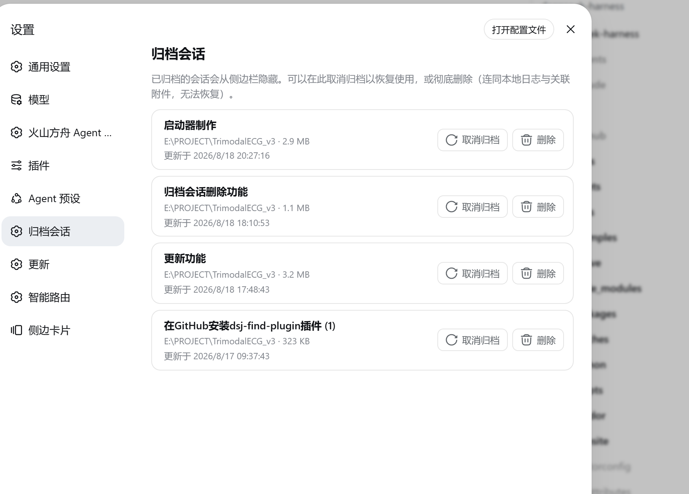

# dsh-archived-sessions

[English](README.md) | 中文

[DeepSeek Harness](https://github.com/deepseek-ai/deepseek-harness)（`dsh`）Web 插件：在**设置（Settings）**页面新增"归档会话"分区，用于集中管理已归档的对话。

> **官方来源：** 本仓库是 npm 包 `dsh-archived-sessions` 的官方来源——`dsh plugin add dsh-archived-sessions` 安装的正是本仓库的代码。



## 功能

- **列出归档会话**：每行显示会话自身的名称（与侧边栏一致的标题）、工作目录、日志大小与最近更新时间。
- **取消归档**：一键将会话恢复到侧边栏，并保持其在工作区中的原始位置。
- **彻底删除**：删除会话的本地日志目录（`~/.dsh/sessions/...`），并删除日志中引用、且不再被其他会话使用的附件对象，最后从工作区记账中移除该会话；删除前必须通过确认对话框。
- **原生观感**：复用与内置设置分区相同的 UI 组件与设计令牌，界面完全一致。

## 前置要求

- 具备工作区**归档**功能的 DeepSeek Harness（`archivedSessionIds` / `archiveSession` 接口）。
- 完整的取消归档/删除记账功能需要核心中的 `WorkspaceRegistry.unarchiveSession` / `deleteSession` 方法。在发布版核心提供之前，插件会优雅降级：仍可列出归档会话并删除磁盘文件，取消归档会给出明确的"重启 `dsh web`"提示。

## 安装

从 npm 安装：

```sh
dsh plugin add dsh-archived-sessions
```

安装后插件会自动挂载（其 `dsh.bundle` patch 会加入 profile 的 bundle 栈）。刷新页面（强刷）加载客户端半，打开 **设置 → 归档会话** 即可使用。

也可以从源码安装：

```sh
git clone https://github.com/Jxy-hy/dsh-archived-sessions.git
cd dsh-archived-sessions
pnpm install
pnpm run build
dsh plugin --profile web add link:./dsh-archived-sessions
```

然后将以下内容追加到 `~/.dsh/profiles/web/cordis.patch.yml`（或通过你偏好的 bundle 机制挂载）：

```yaml
- insert:
    - id: dsh-archived-sessions
      name: 'dsh-archived-sessions'
```

Host 半会通过 profile 的配置 HMR 热挂载；刷新页面（强刷）加载客户端半。打开 **设置 → 归档会话** 即可使用。

## 使用

1. 在侧边栏会话菜单选择"归档会话"，会话从侧边栏隐藏。
2. 打开 **设置 → 归档会话**：
   - **取消归档**：会话恢复到侧边栏的原始位置。
   - **删除**：弹出确认对话框；确认后永久删除本地日志与关联附件（其他会话仍引用的附件对象会被保留），并从工作区记账中移除该会话。

## 架构

- **Host 半**（`src/index.ts`）：在共享 Web 服务上注册 `GET/POST /__dsh-archived-sessions/{list,unarchive,delete}`。删除流程：若会话处于打开状态则先 dispose 活动会话（让内存 store 移除它、持久化层退役其状态）→ 等待 write-behind flush 落盘日志 → 删除会话日志目录 → 解析日志中的附件引用（`sha256:`）→ 仅删除不再被任何其他会话引用的附件对象 → 通过 `WorkspaceRegistry.deleteSession` 清理工作区记账。
- **Client 半**（`src/client/`）：注册 `settings.section` 分区"归档会话"；列表数据合并 `session.list`（含投影标题）与插件 host 接口（创建时间、日志大小）；两种变更操作都走插件 host 接口，因为核心 RPC 面不提供这两个操作。删除成功后，client 会重新拉取 `session.list` 基线：删除**冷会话**（已持久化、当前未打开）不会触发 `session/disposed`，否则侧边栏会把这个残留行一直显示在**未分组**下，直到下次重连。

## 社区与支持

- 欢迎通过 [GitHub Discussions](https://github.com/Jxy-hy/dsh-archived-sessions/discussions) 提交反馈或 bug 报告。
- 本仓库已添加 [`dsh-plugin`](https://github.com/topics/dsh-plugin) 话题，便于被发现。

## 许可证

[MIT](LICENSE)
